# NexDesk Enterprise Architecture

## 1. Vision

NexDesk is a cross-platform enterprise remote-access platform. It is not limited to a single protocol or operating system.

Supported and planned connection types:

| Protocol | Purpose | Status |
|----------|---------|--------|
| RDP | Interoperability with RDP-compatible endpoints | Active |
| SSH | Secure terminal, SFTP, port forwarding | Planned |
| NexDesk Remote | Full cross-platform remote control | Planned |
| Network Tunnel / VPN | Secure site-level network access | Planned |

---

## 2. High-Level Architecture

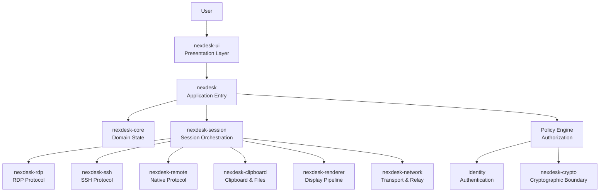

**Key rule:** The UI displays and requests. The application orchestrates. Policy authorizes. Sessions manage lifecycle. Protocols communicate. Cryptography protects. Network transports.

---

## 3. Workspace Structure

```
crates/
├── nexdesk/                # Application entry point (thin)
├── nexdesk-core/           # Domain state: profiles, credentials, settings, vault
├── nexdesk-session/        # Session lifecycle, orchestration, capability negotiation
├── nexdesk-rdp/            # RDP protocol client implementation
├── nexdesk-clipboard/      # Clipboard sync and file transfer
├── nexdesk-renderer/       # Framebuffer and display pipeline
└── nexdesk-ui/             # User interface, navigation, theme, assets

vendor/
├── ironrdp-client/         # Vendored IronRDP client
└── ironrdp-tls/            # Vendored IronRDP TLS

docs/                       # Architecture, security, roadmap documentation
packaging/                  # Desktop files, install scripts
```

### Future crates (create only when boundary is real)

```
crates/
├── nexdesk-crypto/         # Hybrid PQC: ML-KEM, ML-DSA, X25519, Ed25519
├── nexdesk-ssh/            # SSH terminal, SFTP, port forwarding
├── nexdesk-remote/         # Native NexDesk remote protocol
├── nexdesk-network/        # Relay, rendezvous, NAT traversal
├── nexdesk-vpn/            # Network tunnel / site access
├── nexdesk-policy/         # Enterprise policy engine (if extracted from core)
└── nexdesk-identity/       # Enterprise identity (if extracted from core)
```

---

## 4. Dependency Direction

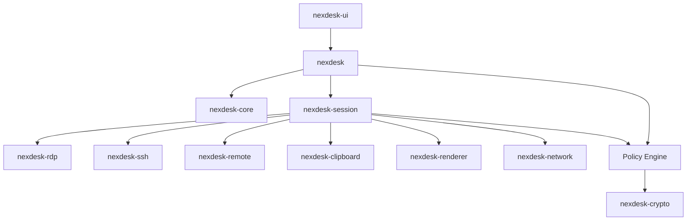

**Rules:**
- Dependencies point downward. No cycles.
- `nexdesk-crypto` must never depend on `nexdesk-session`, UI, or domain crates.
- `nexdesk-core` remains protocol-agnostic and UI-agnostic.
- Protocol crates (`rdp`, `ssh`, `remote`) do not own application-wide state.

---

## 5. Cross-Platform Model

RDP is a protocol. It is not Windows-only. NexDesk connects to any endpoint where a compatible server exists.

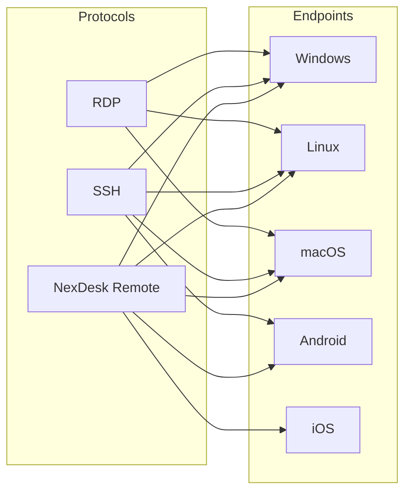

### Client-platform independence

The NexDesk client runs on any platform and connects to any supported endpoint:

```
Linux client    → Windows RDP endpoint
macOS client    → Linux SSH endpoint
Windows client  → Android NexDesk agent
Android client  → macOS NexDesk agent
```

### Endpoint capability negotiation

Capabilities vary by endpoint OS and protocol. They are negotiated at session establishment, not hardcoded.

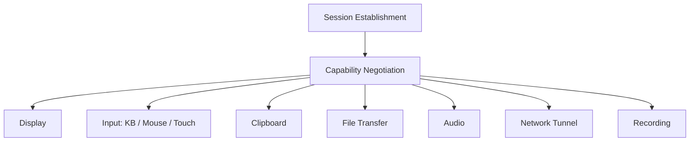

---

## 6. Session Lifecycle

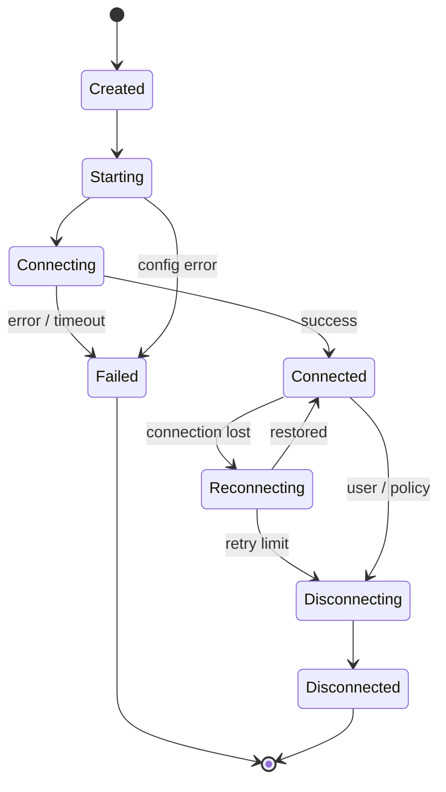

**Rules:**
- The session manager owns lifecycle state.
- Protocol implementations must not directly mutate UI state.
- Reconnection requires a protocol-safe contract. No silent credential replay.

---

## 7. Security Architecture

### 7.1 Security boundaries

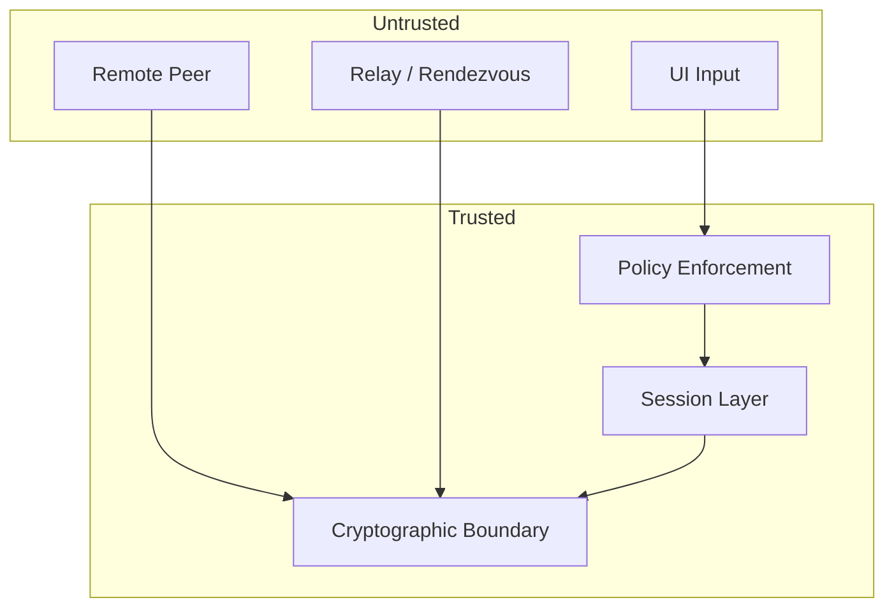

**Critical principle:** A higher-level component must never bypass a security decision enforced by a lower-level component.

- UI cannot grant a denied capability.
- A relay cannot decrypt an end-to-end encrypted session.
- A remote peer cannot silently enable disabled capabilities.

### 7.2 Capability-based authorization

Every remote capability is independently authorized. A connection does not inherit all features.

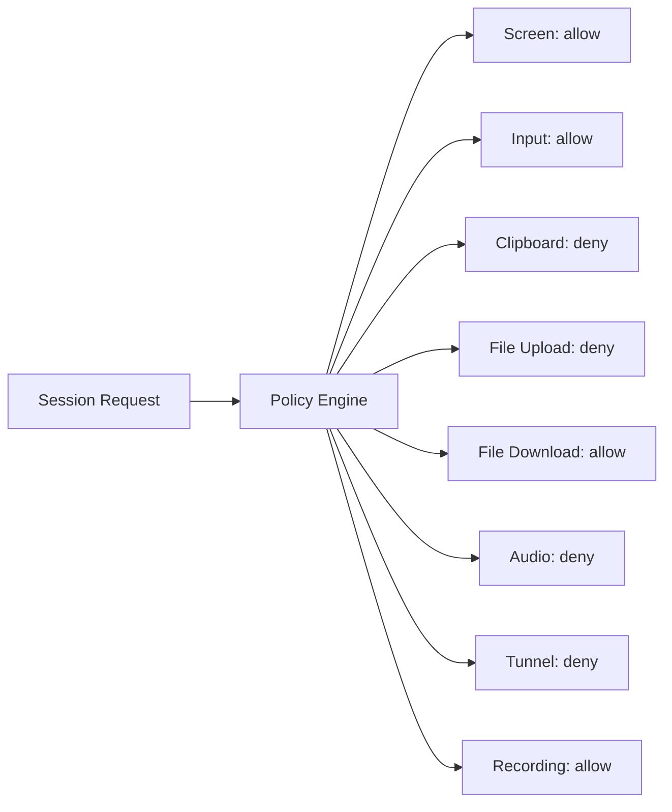

### 7.3 Cryptographic design (target)

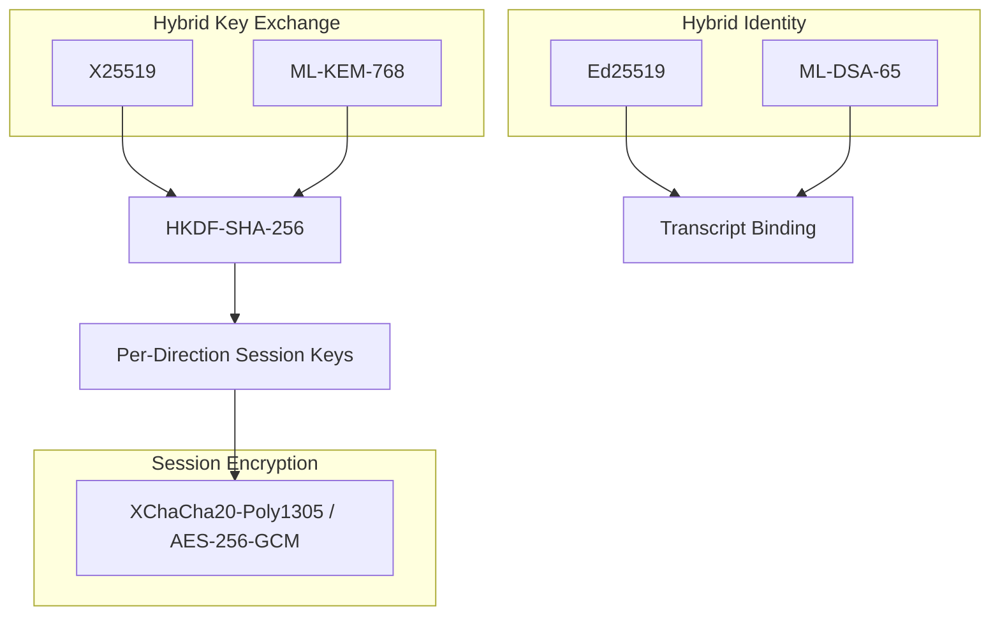

**Properties:**
- Hybrid: secure if either classical or PQ algorithm holds.
- Forward secrecy via ephemeral key material.
- Transcript binding prevents downgrade attacks.
- Algorithm identifiers are explicit. No implicit negotiation.
- Rekeying by time and data volume.

### 7.4 RDP post-quantum mitigation

NexDesk cannot control RDP server TLS parameters. For PQ protection of RDP:

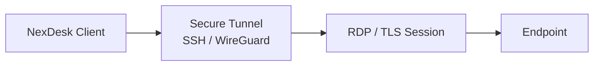

The tunnel provides the PQ protection. The inner RDP session retains its own security properties.

---

## 8. Enterprise Identity

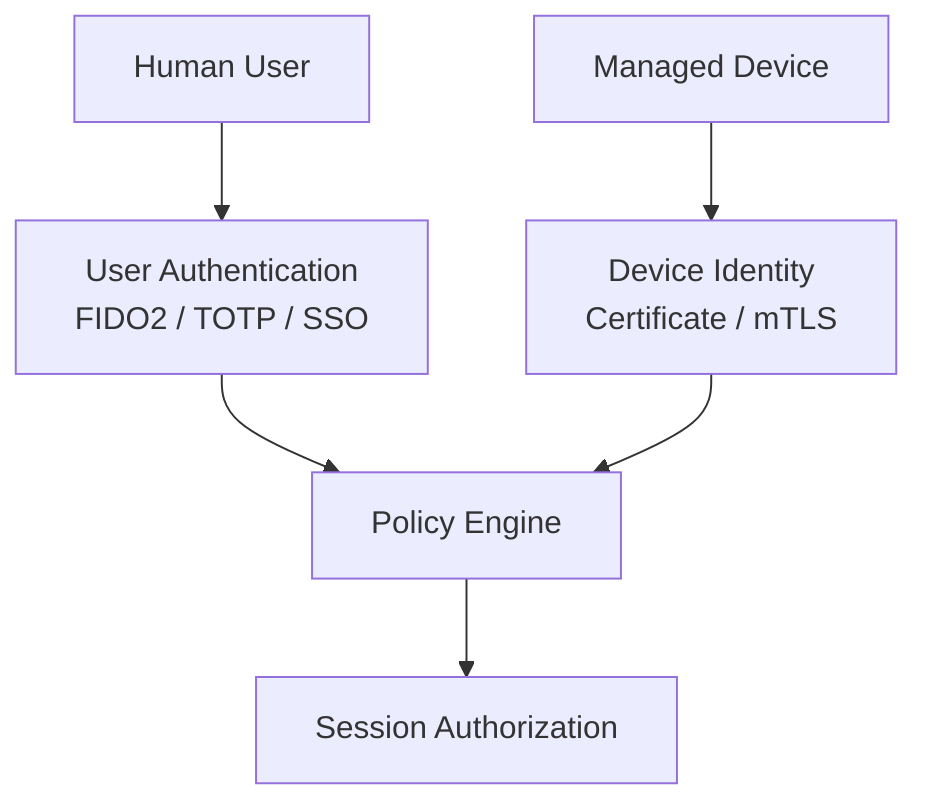

**Rules:**
- Human identity and device identity are separate.
- Authentication ≠ authorization.
- A permanent shared password must not be the only factor for enterprise access.
- Identity supports rotation and revocation.

---

## 9. Enterprise Policy Enforcement

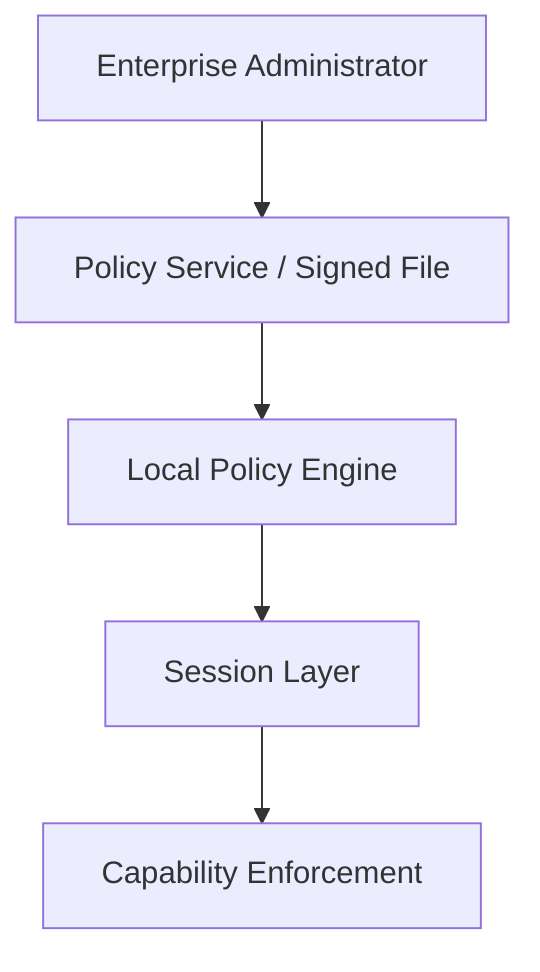

Policy controls include:
- Allowed device IDs and user identities
- Required authentication methods
- Per-capability allow/deny
- Required relay or tunnel
- Minimum client version
- Session duration and idle timeout
- Geographic or network boundaries

**The UI may display policy state. The UI must never override it.**

---

## 10. Network Architecture

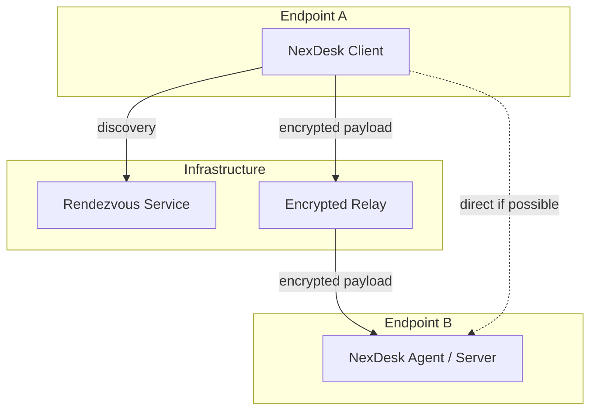

**Rules:**
- Relay sees only ciphertext and routing metadata.
- Relay must not receive session plaintext, clipboard contents, or file contents.
- Metadata (timing, volume, addresses) is visible to infrastructure by design.

---

## 11. Audit Architecture

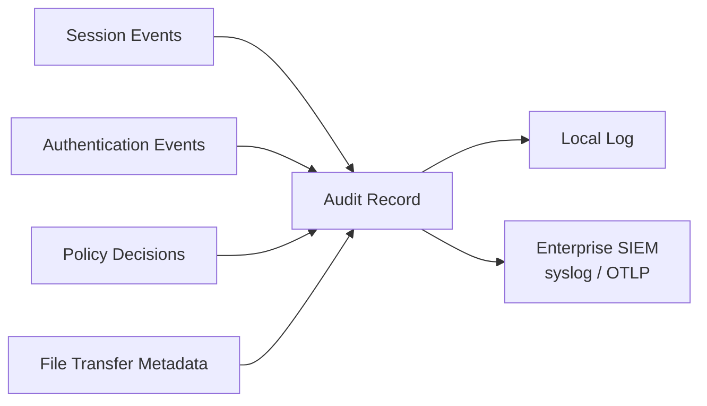

**Audit records must NOT contain:**
- Passwords, tokens, private keys
- Clipboard contents
- File contents
- Screen contents

**Target:** Hash-chained, signed audit records for tamper evidence.

---

## 12. Renderer Architecture

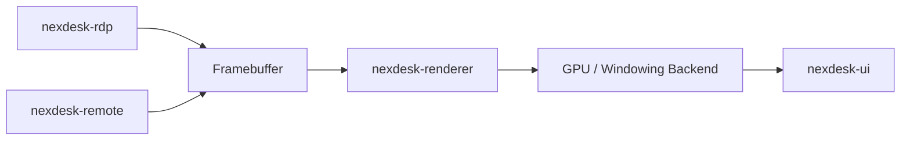

The renderer is independent of protocol decoding. This allows future GPU-accelerated presentation without coupling to any specific protocol implementation.

---

## 13. Credential Flow

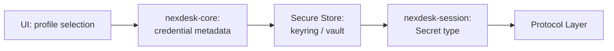

**Rules:**
- Profiles contain connection metadata, not plaintext secrets.
- Secrets enter the session boundary as dedicated secret types.
- The UI never receives plaintext from the persistence layer.
- Secrets are never logged, serialized, or exposed via `Debug`.

---

## 14. Logging

Use structured logging with fields:

```
session_id, device_id, user_id, protocol, destination, state, error_code
```

**Never log:** passwords, tokens, private keys, clipboard contents, file contents, screen contents.

**High-frequency events** (packets, frames, input, clipboard polling): use `trace` or throttled logging. Never unbounded `debug!`.

---

## 15. Crate Responsibility Summary

| Crate | Owns | Must NOT contain |
|-------|------|-----------------|
| `nexdesk` | App startup, composition | Business logic |
| `nexdesk-core` | Domain state, profiles, credentials, settings, vault | Protocol logic, UI state |
| `nexdesk-session` | Session lifecycle, capability negotiation | Cryptographic primitives, UI state |
| `nexdesk-rdp` | RDP protocol client | App-wide state, policy decisions |
| `nexdesk-clipboard` | Clipboard sync, file transfer | Session management, UI |
| `nexdesk-renderer` | Framebuffer, display pipeline | Protocol decoding, business logic |
| `nexdesk-ui` | Presentation, navigation, theme | Security decisions, protocol logic |
| `nexdesk-crypto` *(future)* | Key exchange, signatures, KDF, AEAD | Protocol logic, domain state |
| `nexdesk-ssh` *(future)* | SSH, SFTP, port forwarding | App-wide state |
| `nexdesk-remote` *(future)* | Native remote protocol | App-wide state |
| `nexdesk-network` *(future)* | Relay, rendezvous, NAT traversal | Protocol decoding |
| `nexdesk-vpn` *(future)* | Network tunnel, routing | Session management |

---

## 16. Architectural Principles

1. **Protocol ≠ Platform.** RDP connects to any RDP endpoint. SSH connects to any SSH server. Platform-specific code lives in endpoint adapters.

2. **Security below UI.** The UI requests. Policy decides. A bypassed UI must not grant capabilities.

3. **Capability ≠ Connection.** A connected session does not implicitly receive all features. Each capability is independently authorized.

4. **Crypto is isolated.** Cryptographic primitives live in a dedicated crate with no knowledge of protocols, UI, or domain.

5. **Minimal coupling.** Protocol crates are independent. Adding a new protocol does not require redesigning existing ones.

6. **No premature abstraction.** Create a crate when the ownership boundary is real, not when the name sounds clean.

7. **Fail closed.** Security decisions default to deny. Unknown states produce clean failures, not silent fallbacks.

8. **Forward secrecy.** Long-term identity keys never directly encrypt session traffic.

9. **Audit without exposure.** Security events are logged. Secrets and content are never logged.

10. **Cross-platform by design.** Client OS and endpoint OS are independent variables. The architecture must not encode platform assumptions into protocol or session logic.
